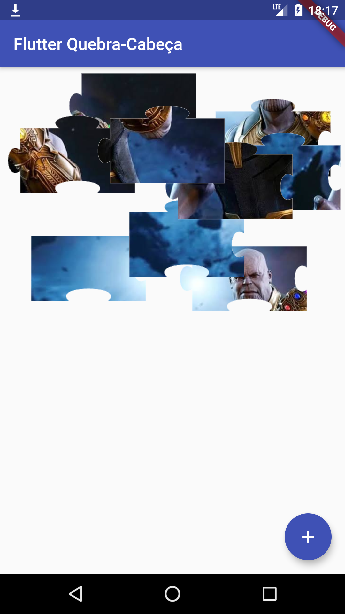
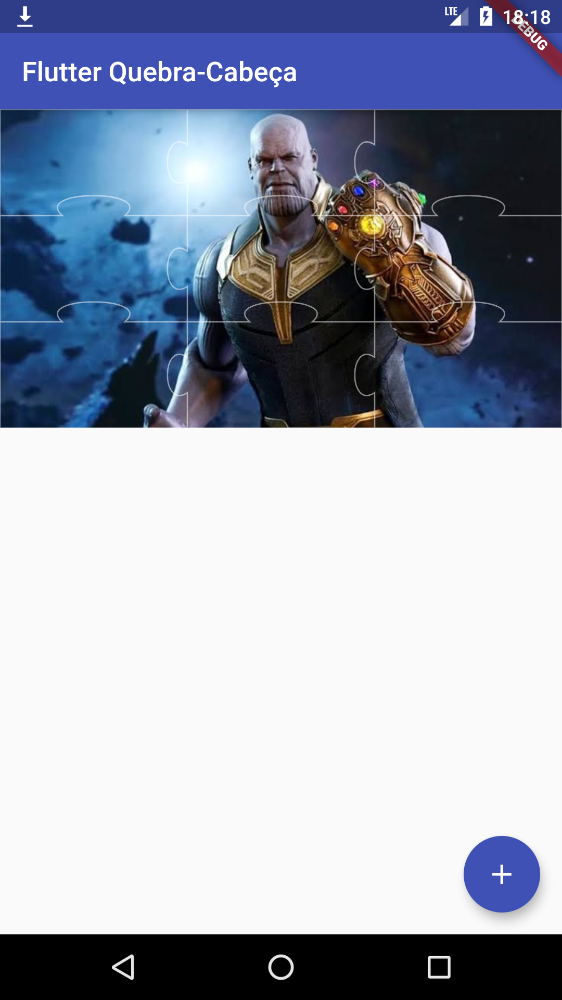

# Flutter Quebra-Cabeça

## Joguinho de quebra-cabeça feito (com muito orgulho :smile:) utilizando o framework Flutter.

Obs.: Baseado no [artigo](https://medium.com/quick-code/building-a-puzzle-game-using-flutter-6f629873102d) escrito por Dragos Holban.

Caso se interesse em utilizar esse maravilhoso framework, basta acessar sua [documentação](https://flutter.dev/docs), 
é rica, com muitos exemplos e repleta de dicas.
